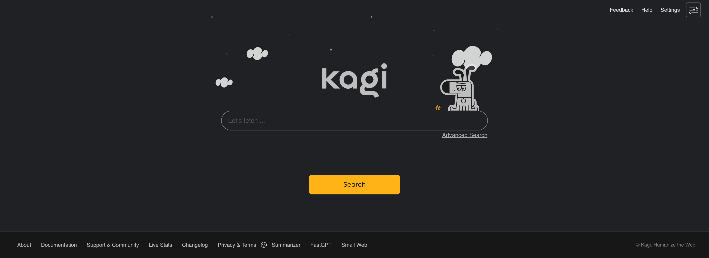
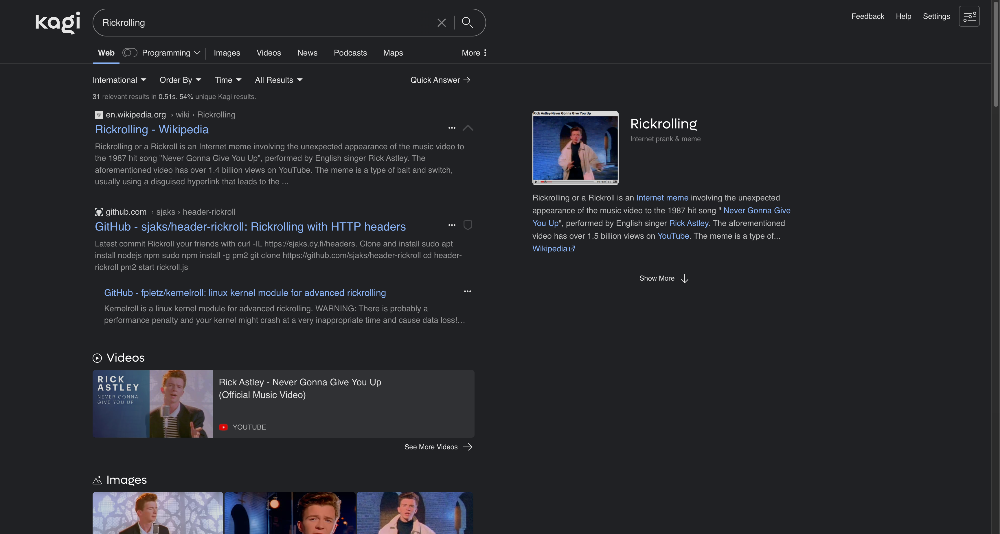

## Kagi Dark Theme

My take on dark theme for [Kagi](https://kagi.com) website.

### Screenshots





### Getting Started (Easy)

You can take a built file from [built file](./build/kagi_dark.min.css) and paste it into your custom CSS
on [Kagi Custom CSS Settings](https://kagi.com/settings?p=custom_css) page.

### Getting Started (Developer)

First, install required dev dependencies.

```shell
pnpm install 
```

Then you can make changes to the [source file](./src/kagi_dark.scss) and built it with the following command:

```shell
pnpm style:compile
```

For minified version of CSS, you can use the command below:

```shell
pnpm style:compile:min
```

## Typical Workflow

1. Check the styles in DevTools on https://kagi.com pages
2. Make local fixes
3. Write those fixes to the [source file](./src/kagi_dark.scss)
4. Compile minified version from source and copy it to clipboard
5. Paste it to [Kagi Custom CSS Settings](https://kagi.com/settings?p=custom_css) page

To compile minified version and copy it to clipboard I'm using the following command (macOS only):

```shell
pnpm style:compile:min | pbcopy
```